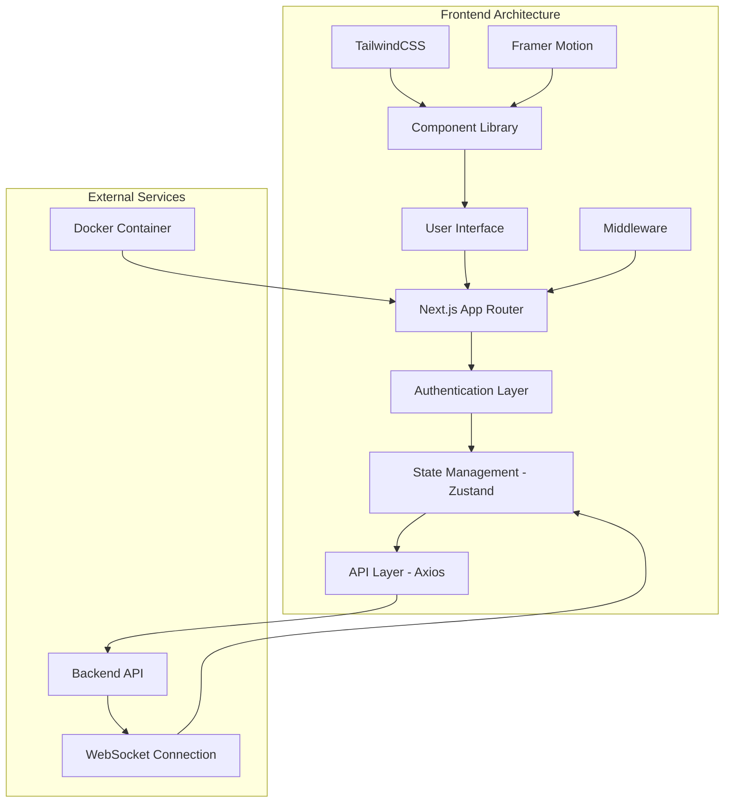

# Sykell Web Crawler Client

A modern, high-performance Next.js frontend application for the Sykell web crawler platform. Built with TypeScript, TailwindCSS, and cutting-edge React patterns to deliver an exceptional user experience for web crawling management.


## 🚀 Features

### Core Functionality

- **🕷️ Web Crawling Management**: Intuitive interface for managing web crawl operations
- **📊 Real-time Analytics**: Live statistics and performance metrics via WebSocket connections
- **🔍 Advanced Data Visualization**: Interactive tables with sorting, filtering, and pagination
- **📱 Responsive Design**: Optimized for desktop, tablet, and mobile devices
- **🌙 Dark Mode**: Built-in dark theme support with system preference detection

### User Experience

- **⚡ Instant Loading**: Optimized with Next.js 15 and Turbopack for lightning-fast development
- **🎭 Smooth Animations**: Framer Motion animations and transitions throughout the UI
- **🔔 Smart Notifications**: Toast notifications with rich content and actions
- **♿ Accessibility**: WCAG 2.1 AA compliant with proper ARIA labels and keyboard navigation
- **🎨 Modern UI**: Beautiful, consistent design system with shadcn/ui components

### Technical Features

- **🔒 Authentication & Authorization**: Secure JWT-based authentication with automatic token refresh
- **🌐 Real-time Updates**: WebSocket integration for live crawl status updates
- **📈 Performance Monitoring**: Built-in analytics and performance tracking
- **🛡️ Type Safety**: Full TypeScript coverage with strict type checking
- **🧪 Testing Suite**: Comprehensive E2E testing with Playwright

## 🏗️ Architecture Overview



_Note: Detailed architecture diagram will be added here_

## 📁 Project Structure

```
client/
├── 📁 app/                          # Next.js App Router pages
│   ├── 📄 layout.tsx               # Root layout with providers
│   ├── 📄 page.tsx                 # Landing page
│   ├── 📁 (auth)/                  # Authentication routes
│   │   ├── 📁 login/               # Login page
│   │   └── 📁 register/            # Registration page
│   └── 📁 dashboard/               # Protected dashboard routes
│       ├── 📄 layout.tsx           # Dashboard layout with sidebar
│       ├── 📄 page.tsx             # Main dashboard
│       └── 📁 crawl/               # Crawl management pages
├── 📁 components/                   # Reusable React components
│   ├── 📁 ui/                      # Base UI components (shadcn/ui)
│   ├── 📁 data-table/              # Advanced table components
│   ├── 📁 magicui/                 # Enhanced UI components
│   ├── 📁 motion-primitives/       # Animation components
│   ├── 📄 app-sidebar.tsx          # Application sidebar
│   ├── 📄 crawls-table.tsx         # Main crawls data table
│   ├── 📄 landing-hero.tsx         # Landing page hero section
│   ├── 📄 login-form.tsx           # Authentication forms
│   └── 📄 stats-grid.tsx           # Dashboard statistics grid
├── 📁 store/                       # State management
│   ├── 📄 auth-store.ts            # Authentication state
│   ├── 📄 crawl-store.ts           # Crawl data state
│   └── 📄 auth-hydrator.tsx        # SSR state hydration
├── 📁 hooks/                       # Custom React hooks
│   ├── 📄 use-data-table.ts        # Data table functionality
│   ├── 📄 use-mobile.ts            # Mobile detection
│   └── 📄 use-debounced-callback.ts # Debounced operations
├── 📁 lib/                         # Utility functions
│   ├── 📄 utils.ts                 # Common utilities
│   ├── 📄 format.ts                # Data formatting
│   └── 📄 parsers.ts               # Data parsing
├── 📁 types/                       # TypeScript definitions
│   ├── 📄 index.ts                 # Core type definitions
│   └── 📄 data-table.ts            # Table-specific types
├── 📁 api/                         # API integration
│   └── 📄 api.tsx                  # HTTP client configuration
├── 📁 config/                      # Configuration files
│   └── 📄 data-table.ts            # Table configuration
├── 📁 tests/                       # Test suites
│   ├── 📄 auth.spec.ts             # Authentication tests
│   ├── 📄 crawl-control.spec.ts    # Crawl management tests
│   └── 📄 user-journey.spec.ts     # End-to-end user flows
├── 📁 public/                      # Static assets
│   ├── 📄 sykell_logo.png          # Brand assets
│   └── 📁 fonts/                   # Custom fonts
├── 📄 middleware.ts                # Next.js middleware
├── 📄 next.config.mjs              # Next.js configuration
├── 📄 tailwind.config.js           # TailwindCSS configuration
├── 📄 tsconfig.json                # TypeScript configuration
├── 📄 playwright.config.ts         # Playwright test configuration
├── 📄 Dockerfile                   # Docker configuration
└── 📄 package.json                 # Dependencies and scripts
```

## 🛠️ Technology Stack

### Core Framework

- **[Next.js 15](https://nextjs.org/)** - React framework with App Router and Turbopack
- **[React 19](https://react.dev/)** - UI library with latest features and hooks
- **[TypeScript 5](https://www.typescriptlang.org/)** - Type-safe development

### State Management & Data Fetching

- **[Zustand](https://zustand-demo.pmnd.rs/)** - Lightweight state management
- **[Axios](https://axios-http.com/)** - HTTP client for API requests
- **[React Hook Form](https://react-hook-form.com/)** - Performant form handling
- **[Zod](https://zod.dev/)** - Schema validation and type inference

### UI & Styling

- **[TailwindCSS 4](https://tailwindcss.com/)** - Utility-first CSS framework
- **[shadcn/ui](https://ui.shadcn.com/)** - High-quality component library
- **[Radix UI](https://www.radix-ui.com/)** - Unstyled, accessible components
- **[Framer Motion](https://www.framer.com/motion/)** - Animation library
- **[Lucide React](https://lucide.dev/)** - Icon library

### Data Visualization & Tables

- **[@tanstack/react-table](https://tanstack.com/table/v8)** - Powerful table functionality
- **[Recharts](https://recharts.org/)** - Charts and data visualization
- **[date-fns](https://date-fns.org/)** - Date manipulation utilities

### Development & Testing

- **[Playwright](https://playwright.dev/)** - End-to-end testing framework
- **[ESLint](https://eslint.org/)** - Code linting and formatting
- **[Docker](https://www.docker.com/)** - Containerization

### Additional Libraries

- **[nuqs](https://nuqs.47ng.com/)** - URL state management
- **[cmdk](https://cmdk.paco.me/)** - Command palette
- **[Sonner](https://sonner.emilkowal.ski/)** - Toast notifications
- **[next-themes](https://github.com/pacocoursey/next-themes)** - Theme management

## ⚙️ Getting Started

### Prerequisites

- **Node.js** 20+ (LTS recommended)
- **pnpm** 8+ (preferred package manager)
- **Docker** (optional, for containerized development)

### Installation

1. **Clone the repository**

   ```bash
   git clone <repository-url>
   cd client
   ```

2. **Install dependencies**

   ```bash
   pnpm install
   ```

3. **Set up environment variables**

   ```bash
   cp .env.example .env
   ```

   Configure the following variables:

   ```env
   NEXT_PUBLIC_API_BASE_URL=http://localhost:8088/api/v1
   NEXT_PUBLIC_WS_BASE_URL=ws://localhost:8088/api/v1/ws
   ```

4. **Start the development server**

   ```bash
   pnpm dev
   ```

5. **Open your browser**
   Navigate to [http://localhost:3000](http://localhost:3000)

### Alternative: Docker Development

```bash
# Build and run with Docker
docker build -t sykell-client .
docker run -p 3000:3000 sykell-client

# Or use Docker Compose (if available)
docker-compose up
```

## 🔧 Configuration

### Environment Variables

| Variable                   | Description               | Default                         | Required |
| -------------------------- | ------------------------- | ------------------------------- | -------- |
| `NEXT_PUBLIC_API_BASE_URL` | Backend API base URL      | `http://localhost:8088/api/v1`  | ✅       |
| `NEXT_PUBLIC_WS_BASE_URL`  | WebSocket server URL      | `ws://localhost:8088/api/v1/ws` | ✅       |
| `BUILD_STANDALONE`         | Enable standalone build   | `false`                         | ❌       |
| `NEXT_TELEMETRY_DISABLED`  | Disable Next.js telemetry | `false`                         | ❌       |

### Next.js Configuration

The application is configured with:

- **Turbopack** for faster development builds
- **SVG handling** with @svgr/webpack for React components
- **Standalone output** for optimized Docker builds
- **Asset prefix** for CDN deployment ready

### TailwindCSS Configuration

Custom design system with:

- **Dark mode** support with class strategy
- **Custom animations** and transitions
- **Component-specific utilities**
- **Responsive breakpoints** for all device sizes

## 📊 State Management

### Zustand Stores

#### Authentication Store (`auth-store.ts`)

Manages user authentication state, login/logout actions, and session persistence.

```typescript
interface AuthState {
  user: User | null;
  status: "authenticated" | "unauthenticated";
  login: (user: User) => void;
  logout: () => void;
  initialize: (user: User | null) => void;
}
```

#### Crawl Store (`crawl-store.ts`)

Handles crawl data management, real-time updates, and bulk operations.

```typescript
interface CrawlState {
  crawls: Crawl[];
  stats: CrawlStats;
  loading: boolean;
  error: string | null;
}
```

### Server-Side State Hydration

The application uses a custom hydration system to seamlessly transfer server-rendered user state to the client, preventing hydration mismatches and ensuring consistent authentication state.

## 🎨 UI Components

### Component Architecture

The UI follows a layered architecture:

1. **Base Components** (`ui/`) - Core shadcn/ui components
2. **Composite Components** - Feature-specific compositions
3. **Layout Components** - Page structure and navigation
4. **Page Components** - Complete page implementations

### Key Components

- **DataTable** - Advanced table with sorting, filtering, pagination, and bulk operations
- **AppSidebar** - Collapsible navigation with responsive design
- **CrawlsTable** - Specialized table for crawl data with real-time updates
- **StatsGrid** - Dashboard metrics with animated counters
- **AuthForms** - Login and registration with validation

### Animation System

Framer Motion integration provides:

- **Component animations** for enhanced UX
- **Loading states** with skeleton components
- **Gesture handling** for mobile interactions

## 🧪 Testing

### Test Structure

```
tests/
├── 📄 auth.spec.ts              # Authentication flow tests
├── 📄 crawl-control.spec.ts     # Crawl management tests
├── 📄 user-journey.spec.ts      # Complete user journey E2E
└── 📄 README.md                 # Testing documentation
```

### Test Scenarios

1. **Authentication Tests**

   - User registration and login
   - Session persistence
   - Logout functionality

2. **Crawl Management Tests**

   - Adding single and multiple URLs
   - Viewing crawl details
   - Bulk operations (re-analyze, delete)
   - Real-time status updates

3. **User Journey Tests**
   - Complete end-to-end workflows
   - Cross-browser compatibility
   - Mobile responsiveness

### Running Tests

```bash
# Run all tests
pnpm test:e2e

# Run tests in headed mode (visible browser)
pnpm test:e2e:headed

# Run specific test suites
pnpm test:e2e:auth
pnpm test:e2e:crawls
pnpm test:e2e:main

# Generate test reports
pnpm test:e2e:report
```

## 🐳 Docker Support

### Production Build

The Dockerfile uses multi-stage builds for optimization:

1. **Dependencies stage** - Install only production dependencies
2. **Builder stage** - Build the Next.js application
3. **Runtime stage** - Minimal runtime environment

### Docker Configuration

```dockerfile
# Key features:
- Node.js 24 Alpine base image
- Multi-stage build for size optimization
- Support for multiple package managers
- Environment variable injection
- Standalone output for minimal runtime
```

### Container Deployment

```bash
# Build the container
docker build -t sykell-client .

# Run with environment variables
docker run -p 3000:3000 \
  -e NEXT_PUBLIC_API_BASE_URL=https://api.example.com \
  sykell-client
```

## 📈 Performance Optimizations

### Next.js Optimizations

- **App Router** for improved performance and developer experience
- **Turbopack** for faster development builds
- **Automatic code splitting** for optimized bundles
- **Image optimization** with next/image
- **Font optimization** with next/font

### React Optimizations

- **Memoization** with useMemo and useCallback
- **Lazy loading** for components and routes
- **Virtual scrolling** for large datasets
- **Debounced operations** to reduce API calls

### Bundle Optimization

- **Tree shaking** to eliminate unused code
- **Dynamic imports** for code splitting
- **SVG optimization** with SVGR
- **Asset optimization** with Next.js built-in tools

## 🔐 Security Features

### Authentication & Authorization

- **JWT token management** with automatic refresh
- **Secure cookie handling** with httpOnly flags
- **Route protection** with middleware
- **Session timeout** handling

### Data Protection

- **Input validation** with Zod schemas
- **XSS prevention** with proper sanitization
- **CSRF protection** through secure defaults
- **Content Security Policy** headers

### API Security

- **Request/response interceptors** for error handling
- **Rate limiting** awareness (frontend)
- **Secure communication** over HTTPS in production
